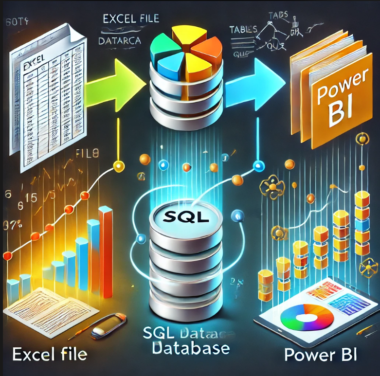
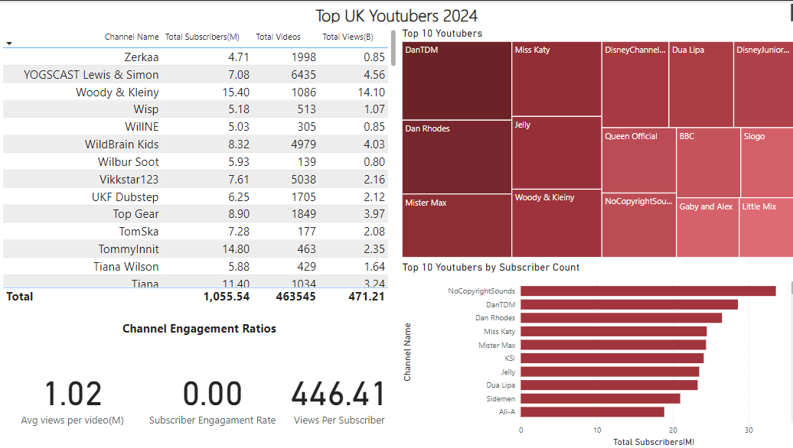

# Research Porfolio: Excel to SQL to PowerBI



# Table of contents

- [Objective](#objective)
- [Data Source](#data-source)
- [Design](#design)
  - [Tools](#tools)
- [Development](#development)
  - [Data Exploration](#data-exploration)
  - [Data Cleaning](#data-cleaning)
  - [Data Transformation](#data-transformation)
- [Data Quality Test](#data-quality-test)
- [Data Visualisation](#data-visualisation)
- [Findings](#findings)
- [Recommendations](#recommendations)
- [Conclusion](#conclusion) 


# Objective

Design a dashboard that delivers critical insights into the top UK YouTubers, enabling the investment team to strategically identify which creators present the best partnership opportunities based on their viewership metrics. The goal is to help the company choose influencers whose audience engagement and reach can drive product sales, maximize revenue, and contribute to the overall growth of the company and its product portfolio


# Data source

The data was sourced from kaggle and contains the viewship metrics of each individual youtuber such as channel name,views,subcribers and total videos

# Design

Design a Power BI dashboard that showcases key viewership metrics of individual YouTubers, providing the investment team with a comprehensive and interactive overview of each creator's performance. The dashboard should offer a user-friendly interface, enabling detailed analysis of various metrics to support informed decision-making when selecting potential partners for product promotion and revenue growth

# Tools

|Tool 	|Purpose|
|-------|-------|
|Excel 	|Exploring the data|
|SQL Server 	|Cleaning, testing, and analyzing the data|
|Power BI 	|Visualizing the data via interactive dashboards|
|GitHub 	|Hosting the project documentation and version control|

# Development
The process begins with gathering the relevant dataset, followed by an initial exploration in Excel to understand the data. The data is then loaded into SQL Server for structured storage and cleaned using SQL queries to ensure accuracy. After testing the data for consistency, it is visualized in Power BI, where key viewership metrics and insights are presented. These findings are analyzed to determine the best YouTuber partnerships for the investment team. The process is documented, and finally, the data, insights, and documentation are published on GitHub Pages for easy access and collaboration


## Data exploration

The dataset is first explored in Excel to perform an initial review, where key columns are identified, data profiling is conducted, and the the patterns in the dataset examined. Once a basic understanding is established, the data is imported into SQL Server to enable more robust handling, and querying, ensuring it is ready for  efficient analysis

## Data cleaning
The objective is to refine the dataset, ensuring it is well-structured and ready for analysis. This involves retaining only relevant columns, ensuring data types are appropriate for each column, and eliminating null values to guarantee that all records are complete and accurate

Below is a table outlining the constraints on our cleaned dataset

|Property |	Description |
|---------|-------------|
|Number of Rows | 	100 |
|Number of Columns |	4 |

And here is a tabular representation of the expected schema for the clean data

|Column Name 	    |Data Type 	|Null|
|-----------------|-----------|----|
|channel_name 	  |VARCHAR 	  |NO  |
|total_subscribers|INTEGER    |NO  |
|total_views      |INTEGER    |NO  |
|total_videos 	  |INTEGER 	  |NO  |


## Data transformation

```sql

/*
# 1. Select the required columns
# 2. Extract the channel name from the 'NOMBRE' column
*/

-- 1.
SELECT
    SUBSTRING(NOMBRE, 1, CHARINDEX('@', NOMBRE) -1) AS channel_name,  -- 2.
    total_subscribers,
    total_views,
    total_videos

FROM
    top_uk_youtubers_2024

```

``` sql
/*
# 1. Create a view to store the transformed data
# 2. Cast the extracted channel name as VARCHAR(100)
# 3. Select the required columns from the top_uk_youtubers_2024 SQL table 
*/

-- 1.
CREATE VIEW view_uk_youtubers_2024 AS

-- 2.
SELECT
    CAST(SUBSTRING(NOMBRE, 1, CHARINDEX('@', NOMBRE) -1) AS VARCHAR(100)) AS channel_name, -- 2. 
    total_subscribers,
    total_views,
    total_videos

-- 3.
FROM
    top_uk_youtubers_2024
```

# Data visualisation

Below is a visualization presentation showcasing the various youtubers along with their viewship metrics


The Power BI dashboard provides an insightful analysis of the top UK YouTubers based on several key metrics, helping the investment team assess potential partnership opportunities.

Key Observations:
Top YouTubers by Subscriber Count:

NoCopyrightSounds holds the largest subscriber base, followed closely by DanTDM and Dan Rhodes. These channels offer significant reach, making them valuable for product partnerships.

Top 10 YouTubers (Treemap Visualization):

DanTDM and Miss Katy stand out in terms of prominence, suggesting they dominate in overall metrics such as subscribers and views.

Channel Engagement Ratios:

The dashboard highlights key engagement metrics:
Average views per video is 1.02M, indicating solid viewership across the channels.
Views per Subscriber stands at 446.41, suggesting that the audience is actively consuming content relative to the subscriber count.
Subscriber Engagement Rate is notably low, at 0.00. This could suggest limited interaction in terms of likes, comments, or shares, requiring further analysis of engagement beyond just views.

Strategic Insights for the Investment Team:
Channels like NoCopyrightSounds, DanTDM, and DanRhodes should be considered for partnerships based on their high subscriber counts and viewership metrics.
Woody & Kleiny are particularly attractive due to their high total views, making them ideal for campaigns focused on wide-reaching visibility.
The relatively low engagement rate suggests that while views are strong, deeper interaction metrics should be considered for certain YouTubers, ensuring that partnerships target not only reach but also active audience participation.

# Findings


Key Assumptions and Inputs:
Conversion rate: 2% (0.02), which implies that 2% of viewers potentially purchase a product.
Product cost: $5 per unit.
Campaign cost: $50,000 per video.
Channels:
The analysis is conducted on three channels:

NoCopyrightSounds
DanTDM
Dan Rhodes
Metrics Being Compared:
Average Views per Video (Excel vs SQL): This column shows that the average views per video are identical between the Excel and SQL methods, indicating consistency in the source data.

Potential Product Sales per Video:

This is calculated by multiplying the average views by the conversion rate (2%).
The number of potential sales per video is also the same for both Excel and SQL analyses.
Examples:

NoCopyrightSounds: 138,400 sales.
DanTDM: 106,800 sales.
Dan Rhodes: 223,000 sales.
Potential Revenue per Video ($ USD):

This is calculated by multiplying the potential product sales by the product cost ($5).
Again, the figures match between the Excel and SQL calculations, showing no discrepancy.

Net profit is the potential revenue minus the campaign cost ($50,000).
As expected, these values are the same in both Excel and SQL columns.
Examples:

NoCopyrightSounds: $642,000.
DanTDM: $484,000.
Dan Rhodes: $1,065,000.
Observations:
Accuracy of Data (Excel vs SQL): There are no differences in any of the metrics between the two methods (Excel vs SQL), indicating that both analyses yield the same results.

Revenue and Profit Trends:

Dan Rhodes has the highest potential revenue and net profit per video due to the large number of views (111.5M average views).
NoCopyrightSounds ranks second in both revenue and profit.
DanTDM has the lowest potential revenue and profit, driven by the lower view count (53.4M).
Conclusion:
The table shows consistent results between Excel and SQL analyses across all key metrics, including potential product sales, revenue, and net profit. Dan Rhodes is the most profitable channel by a wide margin, while DanTDM, despite having fewer views, still generates a significant profit


# Recommendations
Based on the viewship metrics that is the views per subcriber, Dan Rhodes appears to be the best option because there is a higher ROI compared to other channels


